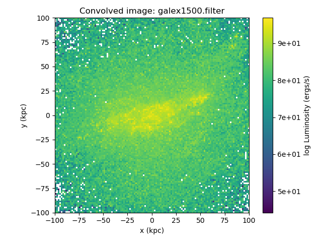

Quickstart
**********

In the examples subdirectory of the `powderday
<https://github.com/dnarayanan/powderday.git>`_ root directory are some
example snapshots for different hydro codes suppported thusfar.  This
will likely change over time as the code evolves and parameter files
change.  Also, eventually the examples will migrate to the `agora
<https://sites.google.com/site/santacruzcomparisonproject/>`_ project
snapshots.

For each example file there should be two parameter files that will be
reasonable for the associated snapshot, though you'll need to edit the
hard linked directories that specify where (e.g.) dust files are and
output should go. To run `powderday
<https://github.com/dnarayanan/powderday.git>`_) in any directory::

  >pd_front_end.py example directory parameters_master_file
  parameters_model_file

Note - the .py extensions on the parameter files need to be left off.

SEDs
=======

For example, we have run a gizmo cosmological zoom simulation of a
`Milky Way mass galaxy
<https://ui.adsabs.harvard.edu/abs/2018ApJ...869...70N/abstract>`_
that can be downloaded here (6 GB download):

 <https://www.dropbox.com/s/g6d47z3pm8l18p7/snapshot_134.hdf5?dl=0>

To run `powderday <https://github.com/dnarayanan/powderday.git>`_ on the simulation,
you would type::

  >pd_front_end.py examples/gadget/mw_zoom parameters_master_401 parameters_model_401

The SED (placed at z = 3 with a Planck13 cosmology) looks like:

.. image:: images/gadget_sed.png
   :align: center

and an example plotting code can be found in the convenience
subdirectory of the `powderday
<https://github.com/dnarayanan/powderday.git>`_ root directory.

The individual parameter files that control this simulation are the
parameters_master file and the parameters_model file.  The
descriptions of these are detailed `here <https://powderday.readthedocs.io/en/latest/parameters_description.html>`_ but in short, the parameters_master file is meant to control paramters
that one might like to remain constant typically for every single
galaxy in a given snapshot, or every snapshot in a model simulation.
In contrast, the parameters_model file has variables such as the
snapshot name, or output file name - variables that one might expect
to change for different galaxies in a snapshot or different snapshots
in a simulation.

Imaging
=======

We can create monochromatic images by running the code in the exact
same manner as above, though setting the flag "IMAGING" to true in the
parameters_master file.  A procedure to plot an image is demonstrated
in the convenience script ``make_image_single_wavelength.py``, found
in the convenience subdirectory.

If filters other than the default filter (arbitrary.filter) are used,
`powderday <https://bitbucket.org/desika/powderday>`_ will convolve the
monochromatic image outputs with each filter's transmission function and save
the result in the output directory as ``convolved.XXX.hdf5``.

Say we've set the following in the parameters master file:

.. codeblock:: python

    IMAGING = True
    filterdir = '/home/cmcclellan1010/pd_cm/filters/'
    filterfiles = [
        'arbitrary.filter',
        'galex1500.filter',
    ]

`powderday <https://bitbucket.org/desika/powderday>`_ will run at each 
wavelength in all of the specified filter files, and produce convolved image
data for each filter.

After running::

    >pd_front_end.py examples/gadget/mw_zoom parameters_master_401 parameters_model_401

we get the standard output files, along with the convolved image data (in this
case, it is named ``convolved.134.hdf5``).

To load in the image data, use::

    import h5py
    f = h5py.File('convolved.134.hdf5', 'r')

Now, the image and filter data can be accessed in the hdf5 file format
(thoroughly described in the `h5py <http://docs.h5py.org/en/stable/quick.html>`_ documentation).

Image data is stored in a 3-dimensional array, with the first axis across the
filters. The image's index is matched to its respective filter filename, stored
in the ``filter_names`` dataset in the ``np.bytes_`` format. So, if you wanted 
to access a convolved image and its corresponding filter name, you could do::

    >>> convolved_image = f['image_data'][0]
    >>> filter_name = f['filter_names'][0].astype(str)
    >>> print(filter_name)
    'galex1500.filter'

The filter's transmission function must be accessed differently. Each filter's 
transmission function is saved in its own dataset and can be called using its
name::

    >>> f['galex1500.filter'][...]
    array([[ 1.3406205e-01,  9.0700000e-07],
           [ 1.3504851e-01,  1.1537571e-01],
           [ 1.3702143e-01,  1.7650714e-01],
           ...

The image width (``float``) and its units (``np.bytes_`` string) are stored as 
attributes of the ``image_data`` dataset. To plot an image, one might do 
something like this::

    import matplotlib.pyplot as plt
    import numpy as np

    fig = plt.figure()
    ax = fig.add_subplot(111)

    w = f['image_data'].attrs['width']
    w_unit = f['image_data'].attrs['width_unit'].astype(str)

    cax = ax.imshow(np.log(convolved_image), cmap=plt.cm.viridis, 
                    origin='lower', extent=[-w, w, -w, w])
    ax.tick_params(axis='both', which='major', labelsize=10)
    ax.set_xlabel('x ({})'.format(w_unit))
    ax.set_ylabel('y ({})'.format(w_unit))
    plt.colorbar(cax, label='log Luminosity (ergs/s)', format='%.0e')
    plt.title("Convolved image: {}".format(filter_name))
    plt.tight_layout()
    plt.show()

